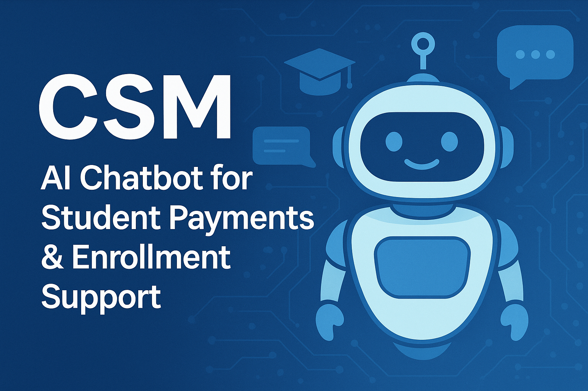

<!-- ======================= BANNER ======================= -->

  

<!-- ======================= BADGES ======================= -->

  
  
  
  
  
  
  
  
  

<!-- ======================= MAIN HEADING ======================= -->
<h1 style="font-size:40px;">🎓 CSM – AI Chatbot for Student Payments & Enrollment Support</h1>

An AI-powered chatbot designed to answer university students’ queries about tuition payments, enrollment procedures, deadlines, scholarships, and more.

<!-- ======================= OVERVIEW ======================= -->
<h2 style="font-size:34px;">📌 Overview</h2>

Managing student queries during admission and enrollment seasons is challenging for universities. Students often face delays, inconsistent information, and dependence on administrative staff. This project solves that by providing an AI-powered chatbot that delivers instant, accurate, and consistent information to students via an easy-to-access platform.

The chatbot uses Machine Learning (ML), Natural Language Processing (NLP), and Artificial Neural Networks (ANN) to understand student questions and respond intelligently. It operates through Telegram, ensuring high accessibility and 24/7 availability. The backend runs on Render Cloud, with user data securely stored in PostgreSQL.

<!-- ======================= FEATURES ======================= -->
<h2 style="font-size:34px;">🚀 Key Features</h2>

<ul>
<li>💬 AI-powered conversation using NLP + ANN</li>
<li>⚡ Instant answers to payment and enrollment queries</li>
<li>🕒 24/7 availability through Telegram</li>
<li>🌐 Cloud-deployed backend (Render)</li>
<li>🛡 Secure user registration with OTP verification</li>
<li>🗂 PostgreSQL database for logs & user details</li>
<li>🔁 Consistent, updated information</li>
<li>🧩 Open-source & fully customizable</li>
<li>📈 Reduces administrative workload</li>
</ul>

<!-- ======================= ARCHITECTURE ======================= -->
<h2 style="font-size:34px;">🧠 System Architecture</h2>

Student → Telegram Bot → Cloud Server (Python ML App) → ANN Model → PostgreSQL DB → Response → Telegram → Student

<!-- ======================= TECHNOLOGIES ======================= -->
<h2 style="font-size:34px;">📚 Technologies Used</h2>

<ul>
<li>Python (ML, NLP, ANN model)</li>
<li>Telegram Bot API</li>
<li>PostgreSQL</li>
<li>Render Cloud Deployment</li>
<li>HTML, CSS, JS</li>
<li>Flask/Django ORM</li>
</ul>

<!-- ======================= MODULES ======================= -->
<h2 style="font-size:34px;">🧩 Core Modules</h2>

<h3 style="font-size:28px;">User Modules</h3>
<ul>
<li>Registration (with email + OTP)</li>
<li>Login</li>
<li>Chat interaction</li>
<li>Query prediction & response generation</li>
<li>Logs & tracking</li>
</ul>

<h3 style="font-size:28px;">Admin Modules</h3>
<ul>
<li>Admin login</li>
<li>User authentication</li>
<li>Model generation & dataset management</li>
<li>Monitoring logs</li>
</ul>

<h3 style="font-size:28px;">Backend Modules</h3>
<ul>
<li>ANN Intent Classification Model</li>
<li>NLP preprocessing</li>
<li>Response generation</li>
<li>Database storage & retrieval</li>
</ul>

<!-- ======================= WORKFLOW ======================= -->
<h2 style="font-size:34px;">📊 How It Works</h2>

<ol>
<li>Student sends a query through Telegram Bot</li>
<li>Message reaches Render Cloud Server</li>
<li>Python app preprocesses the query</li>
<li>ANN model predicts the intent</li>
<li>System retrieves the correct answer</li>
<li>Telegram bot sends a response instantly</li>
</ol>

<h2 style="font-size:34px;">🖼 Screenshots</h2>

<h3 style="font-size:28px;">Home Page – Student Portal</h3>

  

<h3 style="font-size:28px;">Chatbot – Registration & Conversation</h3>

  

<h3 style="font-size:28px;">Admin Dashboard – User Management</h3>

  

<!-- ======================= INSTALLATION ======================= -->
<h2 style="font-size:34px;">🛠 Installation & Setup</h2>

<h3 style="font-size:28px;">1. Clone Repository</h3>

<pre>
git clone https://github.com/Kamalakar17/CSM-A-Chatbot-Solution-to-Manage-Student-Questions-About-Payments-and-Enrollment-in-University.git
cd CSM-A-Chatbot-Solution...
</pre>

<h3 style="font-size:28px;">2. Install Dependencies</h3>

<pre>
pip install -r requirements.txt
</pre>

<h3 style="font-size:28px;">3. Run App</h3>

<pre>
python app.py
</pre>

<h3 style="font-size:28px;">4. Connect Telegram Bot</h3>

Add your bot token in the app configuration.

<!-- ======================= DATABASE ======================= -->
<h2 style="font-size:34px;">🔐 Database (PostgreSQL)</h2>

Stores user registration details, OTP verification, logs, and admin configurations.

<!-- ======================= TESTING ======================= -->
<h2 style="font-size:34px;">🧪 Testing</h2>

The system was tested for unit, integration, functional, and acceptance tests.

✔ All test cases passed successfully.

<!-- ======================= PURPOSE ======================= -->
<h2 style="font-size:34px;">🎯 Purpose</h2>

To automate student support and provide fast, reliable, 24/7 accessible information about payments and enrollment.

<!-- ======================= LICENSE ======================= -->
<h2 style="font-size:34px;">🛡 License</h2>

This project is open-source and customizable for educational and institutional use.

<!-- ======================= CONTRIBUTIONS ======================= -->
<h2 style="font-size:34px;">🤝 Contributions</h2>

Pull requests are welcome! Improve the ANN model, expand datasets, or integrate new features.

<!-- ======================= DEVELOPER ======================= -->
<h2 style="font-size:34px;">👨‍💻 Developed By</h2>

<strong>Puchala Kamalakar Reddy</strong>

